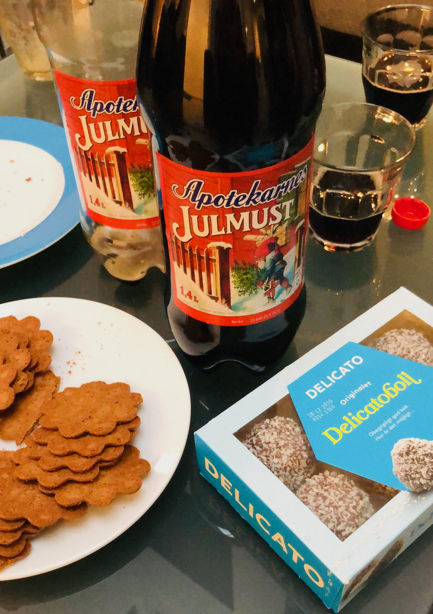

# Roll on, 2020!

*[Jan](https://publiccode.net/team/jan-bio.html), our codebase steward for community, brought Swedish treats for our Christmas fika this week.*

This has been an exhilirating first year for all of us at the Foundation for Public Code.

We've learned so much about how the Foundation for Public Code can best support collaborative public codebases and their maintainers. And we've found friends around the world who are keen to both make better technology, and make technology work better for governments and citizens.

The office will be closed from 21 December 2019 to 6 January 2020 ([see our yearly calendar](about.publiccode.net/organization/yearly-schedule.html)), but you can reach [Boris](https://publiccode.net/team/boris-bio.html) at our office phone number for anything urgent.

From everyone at the Foundation, we wish you a relaxing break and happy new year!
