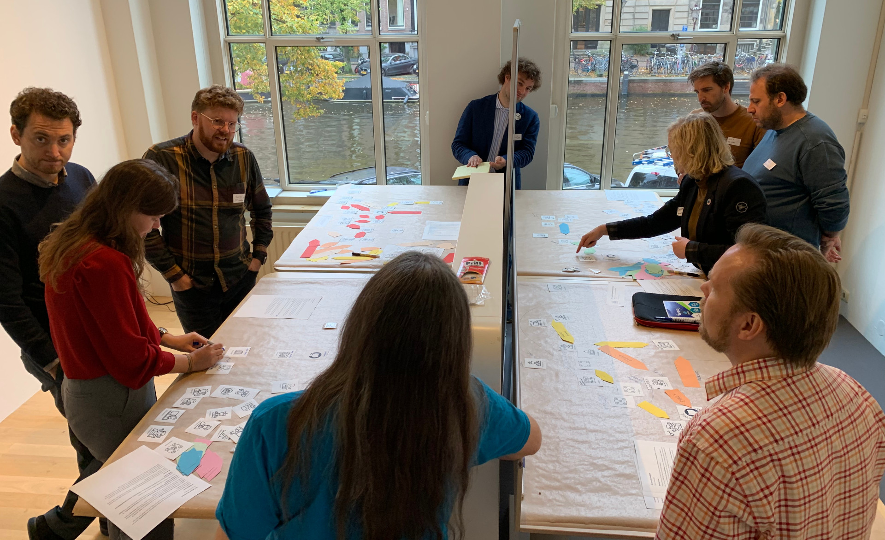
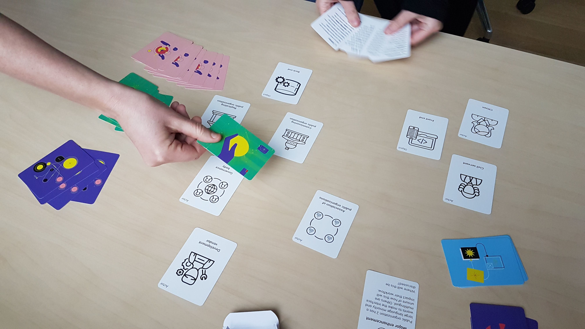

# A look at our Codebase Governance Game

If you [follow us on Twitter](https://twitter.com/publiccodenet/), you may have seen us mention the Codebase Governance Game. Here I'll explain more about its history and future.

## We started with another goal

Last fall we came up with an [exercise](https://about.publiccode.net/activities/workshops/governance-exercise.html) to get people thinking about governance of codebases. We hoped the results of the exercise would help us create the perfect codebase governance diagram. This would help us guide everyone we worked with to adapt this governance model that had been discovered together with people working in this field. Excited to put our theories to the test, we ran a session with civil servants from municipalities, national digital transformation teams and other public organizations.

## An idea is born

However, the ultimate governance model was not the result we got from the exercise. Four parallel groups did the exercise; the models they came up with could not be meaningfully merged into one. Instead, the exercise turned out to be an excellent way to get participants to talk and think about governance and practice a common vocabulary. During the evaluation of the exercise, the idea of enhancing this aspect was mentioned which in turn led to the idea of turning it into a game.

As soon as someone mentions a game, I'm game. We did some very quick mockups and the first play tests inhouse showed that we were on to something. After a few more iterations, it became clear that this was becoming its own thing and thus deserved a proper [repository on GitHub](https://github.com/publiccodenet/governance-game). This makes it possible to track the game's development and also make it easier for anyone to give feedback .

## Getting real

By December 2019 the time had come for us to test the game with a wider audience, so we had a decent prototype made. By testing it extensively and continuing to iterate the design we hope this tool will be a catalyst for code maintainers that are just starting to collaborate on a larger scale. We have already used the prototype as a powerful tool in workshops: it helps participants discover a shared vocabulary, understanding of their ecosystem and sense of purpose. We’ve seen repeatedly that a [governance game workshop](https://about.publiccode.net/activities/workshops/governance-game/) can provide enough clarity and sense of ownership to convert skeptics into champions within their organization.

The game cards themselves have an added value for us. We've found that they are clear and generic enough to use as explanatory aids when we're getting to know new organizations and codebases that we're considering for [stewardship](https://about.publiccode.net/activities/codebase-stewardship/). It gives us an easy way to explore how the current governance is set up and to find existing friction points.

## What's in the future

 Each time we play it with a new group, we discover small improvements we can make to the game. We're also looking for a more suitable production line. Unfortunately we don't have enough decks printed to send out copies, but since the game is freely licensed you can make your own with the resources on GitHub. If you have any ideas or comments on the game feel free to add [an issue](https://github.com/publiccodenet/governance-game/issues/new).

Beyond offering workshops to the codebases that we work with, we plan to produce more supporting materials to make it easier for you to get started on your own. What would make you feel ready to start?
