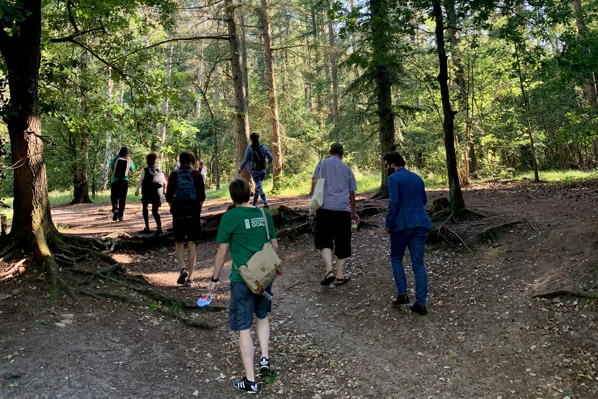

# Overdue socially distant socializing: team outing 2020

The Covid-19 pandemic has brought about quite a few changes at the Foundation for Public Code: we now work mostly from home, virtually onboarded three new colleagues (we grew by 43% in three months!), and have a decontamination station in the office.

With this transition to a virtual working reality we were in dire need of some off-screen socializing with [the entire team](https://publiccode.net/team/). Our Utrecht native and latest addition to the team, Felix Faassen, organized a wonderful day away in the forests of Lage Vuursche in the Netherlands on August 5th.

We spent the day hiking through this very diverse national park (temperate forests, heath, dunes), tried to spot the former Queen Beatrix in her castle, refueled for lunch at restaurant "Buiten in de Kuil", and stopped for ice cream on our way back. Check out the locations on the map below! 

<iframe src="https://www.komoot.com/tour/233215987/embed?profile=1&gallery=1" width="100%" height="680" frameborder="0" scrolling="no"></iframe>

Spending the day together outside the confinement of our homes was a privilege we hope to be able to repeat again soon. We also learned some new things about each other:

* Eric: likes his thesaurus definitions to be very exact
* Boris: likes to rock a suit in the wild and is also a great photographer
* Jan: advocates for Sustainable Development Goal 13 (climate action!), and makes savory wild berry jam in his free time
* Deborah: great mushroom foraging guide when she can avoid the ticks
* Felix: must've been a park ranger in his previous life and loves tiny hamburgers
* Elena: most avid hiker despite a recent hip injury
* Ben: our resident boat captain also works well on land and brings with him an air of urban cool
* Claus: extends his mental powers of balance, focus, and determination to slacklining
* Laura: the best at spotting reptiles yet totally unaware of the power of IoT gadgets
* Alba: was curious about everyone’s favorite Amsterdam swimming spots (to survive the heatwave), which led Jan to create [this open-source map](https://getethermap.org/m/amsterdamswim)

We realized that spending time together in the same physical space doesn't only add value to our interactions, but is a lot of fun! We are already thinking about how we can make our upcoming strategy session happen in person (maybe we can rent [one of these](https://en.wikipedia.org/wiki/Open_air_school)?). Now all that remains is hoping for an Indian summer!

(From left to right: Laura, Ben, Felix, Eric (back), Elena (front), Alba, Claus (back), Boris (mid), Jan (front), Deborah)
